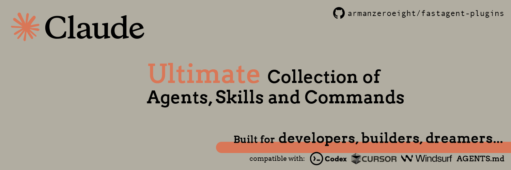

# 🚀 AI Agents and Skills

> [!IMPORTANT]
> 🌟 **This project will be part of a bigger ecosystem! STAY TUNED**
> 
> 🥇 Your contributions will be recognized and featured with your name and GitHub profile. 
>
> 🙌 Join our community of developers making AI coding better for everyone!

An open-source collection of AI agents, subagents, skills, and rules designed to help developers, engineers and builders write standard and maintainable code, **FASTER** ⚡

**Tags:** #cursor #claude #subagents #codex #windsurf #agents.md #kiro #copilot

## 💡 What is this?

[Agents and Skills](https://github.com/armanzeroeight/agents-skills) is a comprehensive collection of modular capabilities that extend AI coding assistants' functionality. It includes:

- **Agents** – Specialized AI personas for different development workflows (frontend, backend, DevOps, etc.)
- **Subagents** – Focused agents for specific tasks within larger workflows
- **Skills** – Modular capabilities containing instructions, scripts, and resources organized in folders
- **Rules** – Best practices, standards, and guidelines for programming languages and tools

Think of it as your AI coding companion's knowledge base – helping you follow industry standards and write clean, maintainable code.

## 🎯 Who is this for?

- Developers who want to follow best practices
- Cloud engineers and Platform engineers
- Teams looking to standardize their coding practices
- AI coding assistants and their users

## 🔌 Compatible Products

This collection works seamlessly with:

- **Claude Code** – Anthropic's AI coding assistant
- **Cursor** – AI-first code editor
- **OpenAI Codex** – OpenAI's code generation model
- **Windsurf** – AI-powered development environment
- **agents.md** – Agent configuration format

## ✨ Features

### 🤖 Agents & Subagents
- **100+ specialized agents** for different development workflows
- **Subagents** for focused, task-specific operations
- Organized by domain: Development, Infrastructure, DevOps, Research, and more

### 🎯 Skills
Create, manage, and share Skills to extend Claude's capabilities in Claude Code.

**Skills are modular capabilities** that extend Claude's functionality through organized folders containing:
- Instructions and prompts
- Scripts and automation
- Resources and documentation
- Configuration files

Skills allow you to package domain expertise and reusable workflows that can be shared across projects and teams.

### 📋 Rules
- **Rule sets** covering a broad spectrum of programming languages and services
- **Best practices** and coding standards
- **AI-optimized** format for seamless integration with coding assistants

### 🌍 Community-Driven
- **Open-source** with contributions from developers worldwide
- **Continuously updated** with the latest best practices

## 📚 What's Included

### 🤖 Agents
Browse our collection of 100+ specialized agents in the `/agents` directory:

- **Development Assist** – Frontend, Backend, Full-stack developers
- **Infrastructure & DevOps** – Cloud architects, Database admins, Network engineers
- **Specialized Domains** – AI/ML engineers, Blockchain developers, Security auditors
- **Content & Research** – Technical researchers, Content marketers, Data analysts
- **And many more!**

### 🎯 Skills
Skills extend your AI assistant's capabilities with modular, reusable components. Each skill is a self-contained folder with everything needed for a specific capability.

### 📋 Rules

| Name | Category | Description |
|------|----------|-------------|
| [Terraform Rules](rules/terraform.md) | Infrastructure as Code | Write clean, secure, and maintainable IaC |

More rules and languages coming soon! 🎉

## 🤝 How to Contribute

We'd love your help making this collection even better! Here's how:

1. **Create a PR** with new agents, skills, rules, or improvements
2. **Follow the template** – check out existing files to see the structure
3. **Add an icon** (for rules) – Drop an SVG logo in the `rules/icons/` directory
   - [Logosear.ch](https://logosear.ch/) has tons of high-quality logos you can use
4. **Keep it simple** – Write in a friendly, straightforward tone. Use emojis when they fit! ✨

### Contributing Agents
- Place agent files in the `/agents` directory
- Use descriptive names (e.g., `frontend-developer.md`, `devops-engineer.md`)
- Include clear role definitions, capabilities, and example use cases

### Contributing Skills
- Create a folder structure with instructions, scripts, and resources
- Document the skill's purpose and usage
- Make it modular and reusable

### Contributing Rules
Each rule file should include:
- **Frontmatter** with metadata (name, description, category, icon, version, globs)
- **Clear examples** showing good vs bad practices
- **Practical code snippets** that developers can actually use
- **Organized sections** covering different aspects of the language/tool

## 📖 How to Use

### For AI Coding Assistants
- **Load agents** to give your AI assistant specialized knowledge and personas
- **Apply rules** as steering files or context in your AI IDE
- **Activate skills** to extend functionality with modular capabilities
- **Chain subagents** for complex, multi-step workflows

### For Developers
- Reference agents and rules during code reviews
- Share with your team as coding standards
- Use as learning resources for best practices
- Contribute improvements based on your experience

### Getting Started
1. Browse the `/agents` and `/rules` directories
2. Copy relevant files to your project or AI assistant configuration
3. Customize as needed for your specific use case
4. Share improvements back with the community

## 🌟 Why [Agents & Skills](https://github.com/armanzeroeight/agents-skills)?

Because writing good code shouldn't be hard. With the right guidelines and AI assistance, you can focus on solving problems instead of remembering syntax and best practices.

---

Made with 💜 by the community, for the community.
